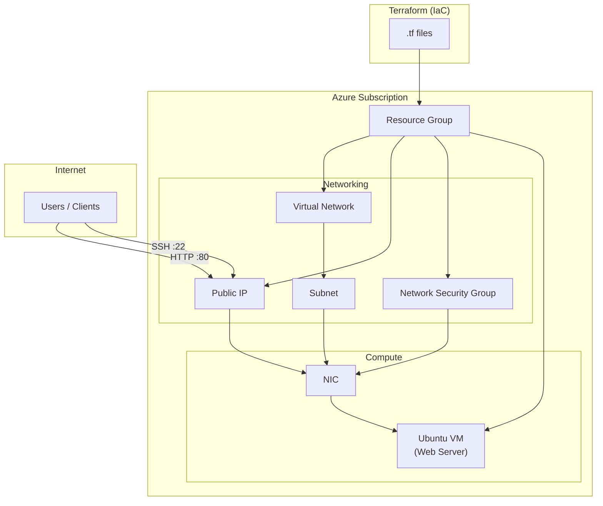

# Azure Web Server – Architecture Diagram

## Scenario
Single Ubuntu web server in Azure, managed by Terraform. Public access for **SSH** (22) and **HTTP** (80).

---

## Architecture Diagram (Mermaid)

---

## Component Summary

| Component | Purpose |
|-----------|---------|
| **Resource Group** | Logical container for all resources in this solution |
| **Virtual Network + Subnet** | Network isolation for the VM |
| **Public IP** | Single public address for SSH and HTTP access |
| **Network Security Group** | Allow inbound TCP 22 (SSH) and 80 (HTTP); deny other inbound by default |
| **Ubuntu VM** | Web server; latest supported Ubuntu LTS |

---

## Traffic Flow

- **HTTP (80):** Internet → Public IP → NSG (allow 80) → NIC → Ubuntu VM (web server).
- **SSH (22):** Internet → Public IP → NSG (allow 22) → NIC → Ubuntu VM (SSH).

Terraform provisions and manages all Azure resources above.
